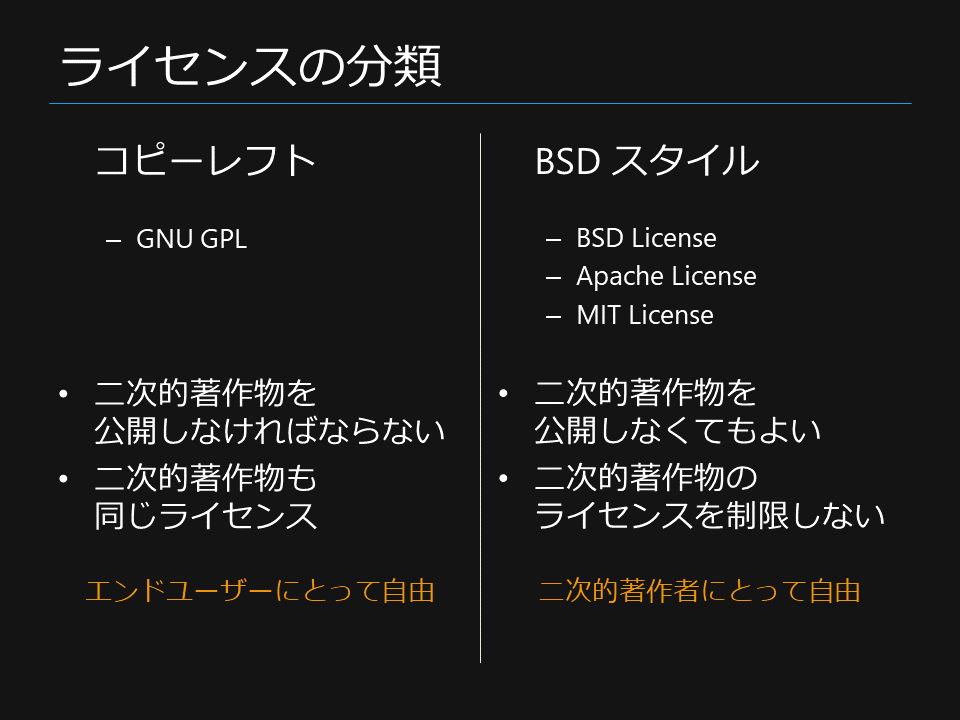
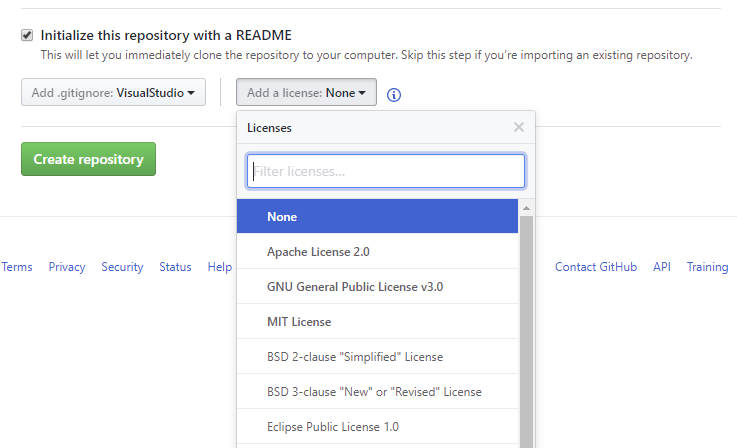
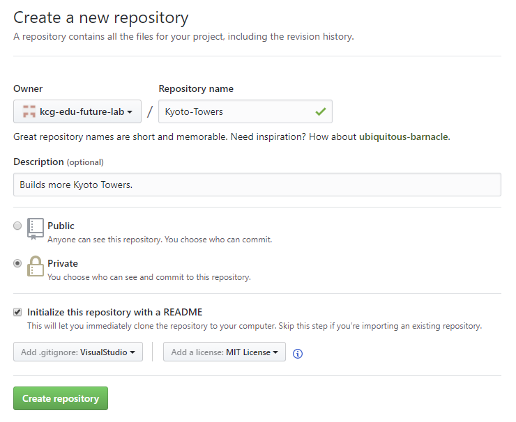

# オープンソース開発についての基礎知識および方針

## オープンソース
- オープンソースの定義: [The Open Source Definition (OSD)](https://ja.wikipedia.org/wiki/%E3%82%AA%E3%83%BC%E3%83%97%E3%83%B3%E3%82%BD%E3%83%BC%E3%82%B9%E3%81%AE%E5%AE%9A%E7%BE%A9)
- ライセンスに基づく公開
  - 「インターネット上で公開されているから何でも自由に使える」ではない
    - [引用は可能](http://www.n-seiryo.ac.jp/~usui/etc/copyright.html)
  - 「著作権表示があるから使えない」「著作権表示がないから使える」でもない

**著作権とライセンス**
- 著作権 (Copyright)
  - 著作権者は誰か
- ライセンス、使用許諾 (License)
  - 著作権者以外の人がどのように使えるか

## 著作権表示
著作権表示の義務はなく、表示しなくても著作権は保護される。  
もし表示するのであれば、万国著作権条約に基づき、次の形式とする。
```
© 1397 Yoshimitsu Ashikaga
```

ただし、[Apache License 2.0](https://ja.osdn.net/projects/opensource/wiki/licenses%2FApache_License_2.0) では次の形式が指定されている。
```
Copyright 1397 Yoshimitsu Ashikaga
```

また以下で述べる通り、他者の著作物を使用する際には、各ライセンスの規定に基づき元の著作権を表示する。

## ライセンス
### ライセンスの分類


### ライセンスの種類
GitHub でリポジトリを作成するときに、付与するライセンスを選択できる (下図)。  
太字で表示されているものが事実上標準のオープンソース ライセンスである。  
なお、「ライセンスがない (None)」は「他の人は使用できない」を意味する。



- MIT License X11
  - BSD スタイル
  - 著作権の表示
- Apache License 2.0
  - BSD スタイル
  - 特許の使用許諾を含む
  - 著作権、特許権の表示
  - 変更箇所の表示
  - 商標は二次使用不可
  - 書面で同意した場合は責任を負う可能性がある
- GNU General Public License v3.0
  - コピーレフト
  - 著作権の表示
  - 変更箇所の表示
  - 二次的著作物も GNU GPL で公開

### ライセンスの適用方針
上記の性質の違いにより、次のような使い分けとなる。
- MIT License X11
  - 主に個人、コミュニティ
- Apache License 2.0
  - 主に企業、注力する技術領域
  - 派生よりも、pull request による貢献を期待する (一元管理)

また、GitHub は オープンソース ライセンス選択のガイドを用意している。
- [Choose an open source license](https://choosealicense.com/)
- [The Legal Side of Open Source](https://opensource.guide/legal/)

#### 新規のリポジトリを作成する場合
事実上標準となっている 3 つのオープンソース ライセンスの中から、目的に応じて選択する。  
一般的に、自身の権利を主張するほど責任が伴う。権利や責任を最も放棄するものが MIT License X11 である。  
kcg.edu Future Lab のリポジトリでは MIT License X11 を適用することを推奨し、その他については必然性を持つ場合に適用する。

#### 既存のリポジトリを fork する場合
- 元のライセンスが BSD スタイル
  - 前項と同様の理由で、なるべく MIT License X11 を適用する
  - [ライセンスを変更している例](https://github.com/sakapon/felicalib-remodeled/blob/master/LICENSE)
- 元のライセンスがコピーレフト
  - もちろん元のライセンスを適用する

### リポジトリ作成画面の例


## 参照

### オープンソース
- [オープンソース](https://ja.wikipedia.org/wiki/%E3%82%AA%E3%83%BC%E3%83%97%E3%83%B3%E3%82%BD%E3%83%BC%E3%82%B9)
- [オープンソースの定義](https://ja.wikipedia.org/wiki/%E3%82%AA%E3%83%BC%E3%83%97%E3%83%B3%E3%82%BD%E3%83%BC%E3%82%B9%E3%81%AE%E5%AE%9A%E7%BE%A9)

### 著作権
- [引用と無断転載・盗作（剽窃）の違い](http://www.n-seiryo.ac.jp/~usui/etc/copyright.html)
- [著作権表示](https://ja.wikipedia.org/wiki/%E8%91%97%E4%BD%9C%E6%A8%A9%E8%A1%A8%E7%A4%BA)
- [年号と©マークと何が必要？Copyright（コピーライト）表記の正しい書き方](https://liginc.co.jp/designer/archives/11313)

### ライセンスの種類
- [コピーレフト](https://ja.wikipedia.org/wiki/%E3%82%B3%E3%83%94%E3%83%BC%E3%83%AC%E3%83%95%E3%83%88)
- [GNU General Public License](https://mag.osdn.jp/07/09/02/130237)
- [BSDライセンス](https://ja.wikipedia.org/wiki/BSD%E3%83%A9%E3%82%A4%E3%82%BB%E3%83%B3%E3%82%B9)
- [Apache License 2.0](https://ja.osdn.net/projects/opensource/wiki/licenses%2FApache_License_2.0)
- [MIT License](https://ja.osdn.net/projects/opensource/wiki/licenses%2FMIT_license)

### ライセンスの適用方針
- [Choose an open source license](https://choosealicense.com/)
- [The Legal Side of Open Source](https://opensource.guide/legal/)
- [GitHubでライセンスを設定する](https://qiita.com/shibukk/items/67ad0a5eda5a94e5c032)
- [MIT LicenseとApache License 2.0のライセンスの違い](http://memomo2.blogspot.jp/2016/02/mit-licensapache-license-20.html)
- [でかい企業のOSSがApache License 2.0だと嬉しい理由](http://d.hatena.ne.jp/nishiohirokazu/20140221/1392962370)

### その他
- [パブリックドメイン](https://ja.wikipedia.org/wiki/%E3%83%91%E3%83%96%E3%83%AA%E3%83%83%E3%82%AF%E3%83%89%E3%83%A1%E3%82%A4%E3%83%B3)
  - 著作権をはじめとする知的財産権を持たない
- [クリエイティブ・コモンズ・ライセンス (CC)](https://creativecommons.jp/licenses/)
  - ソースコードに限定しない
