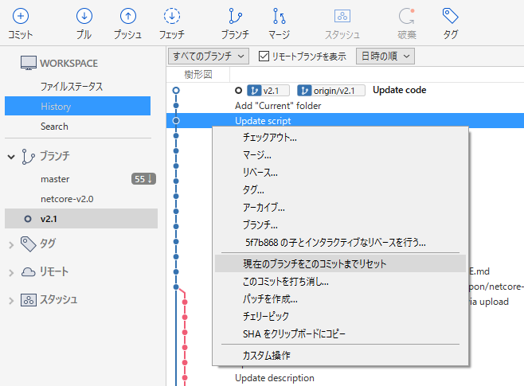

# 付録
その他いろいろ。

## コミットを元に戻す
間違えてコミットしてしまったら、、、

### 特定のコミットだけをなかったことにする (Revert)
例えば「実はその修正は不要だった」と後で気付いた場合、SourceTree でそのコミットを選択して `このコミットを打ち消し` をクリックします。

### 特定のコミットの状態まで戻す (Reset)
過去の特定の状態まで戻す場合、SourceTree でそのコミットを選択して `現在のブランチをこのコミットまでリセット` をクリックします。
例えば最新のコミットから2つ前のコミットを選択してこれを実行した場合、最新のコミットと1つ前のコミットが元に戻ります。

なお、プッシュ後にこれを実行しても、サーバーから削除されるわけではありません。つまり、一度プッシュしたデータは残り続けます。

## たまに使う機能
- GitHub Pages
  - リポジトリを Web サイトとして公開
- Gist
  - コード片
- チーム
  - 複数人での開発 (組織アカウントの機能)
- [Shields.io](https://shields.io/)
  - バッジ

## たまに使う Git コマンド
- `git config --list`
  - Git の設定を確認

## 概念
Git はバージョン管理システム (Version Control System; VCS) の一つです。

以前は StarTeam や Visual SourceSafe などが VCS として業務で使われることが多かったです。
これらの VCS ではローカルでのコミット機能がなく、毎回のコミット (チェックインともいう) のたびにサーバーに送信します。
Git に比べると1段階シンプルな VCS でした。

Git のようにローカルでのコミット機能を持つものをとくに分散型バージョン管理システム (Distributed Version Control System; DVCS) と呼びます。

また、GitHub と同様のサービスに Bitbucket などがあります。
Bitbucket では、VCS として Git だけでなく Mercurial もサポートされています。
