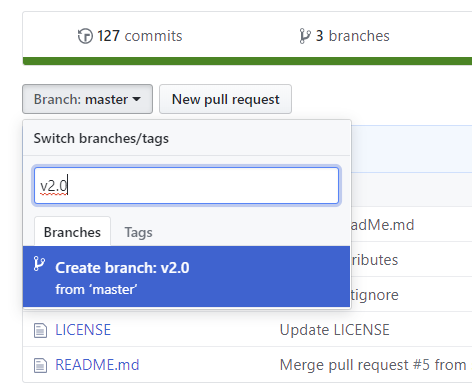

# 応用編: 開発プロジェクトで実践する
開発プロジェクト全体の大まかな手順です。  
ここでは GitHub (ブラウザー) と SourceTree (ローカル) を使います。

## リポジトリを作成 (GitHub)
- 右上の `＋▼` メニューの `New repository` から
  - [詳細の設定について](Repos.md)
  - [ライセンスについて](../OSS)

## ブランチを作成 (GitHub)
本番環境である `master` とは別に、開発用のブランチを作成します。
- ブランチの名前は、例えば `v1.0` とする
  - [セマンティック バージョニング](https://semver.org/lang/ja/)

パッチ バージョンまで入れて `v1.0.0` としてもよい。  
ただし細かい単位になってしまうため、ブランチを増やしたくなければ `v1.0` でもよい。

## ブランチを切り替える (SourceTree)
ローカルの作業用にブランチを設定します。
- フェッチ (サーバーの情報を取得)
- 開発用ブランチに変更

開発用のブランチで開発を進めます。  
`README.md` や Wiki などのドキュメントもプロジェクトの進行により都度更新します。

## リリース準備
さて、開発が一段落したらリリースへ。
- バージョンを確認する
  - `v1.0.0` など
  - [セマンティック バージョニング](https://semver.org/lang/ja/)
- 成果物をまとめる (プロジェクト次第)
  - EXE なら ZIP にするとか
    - `SugoiApp-1.0.0.zip` とか
    - それを `downloads` フォルダーに置くとか
  - ライブラリならパッケージにするとか

ドキュメント類も齟齬がないか確認しましょう。

## プルリクエストおよびマージ (GitHub)
開発用ブランチの成果を `master` に取り込みます。
- ブランチのページで `New pull request` をクリック
  - **Title** : `vX.Y.Z` など
  - **Comment** : そのバージョンにおける主な変更内容を記述
- マージ
  - 変更点を最終確認
  - 一人プロジェクトであれば、そのまま `Merge pull request` をクリックすればよい
  - コミッターが他にいる場合、コミッターの作業

## リリース (GitHub)
セーブポイントのような機能です。現在のリポジトリの状態にタグ付けをすることにより、あとからでも特定のリリース時のファイルを取得することができます。
- `Releases` のページで `Create a new release` をクリック
  - **Tag** : `vX.Y.Z` など
  - **Title** : `vX.Y.Z` など
  - **Description** : そのバージョンにおける主な変更内容を記述
  - ここに ZIP ファイルなどを登録することもできる
